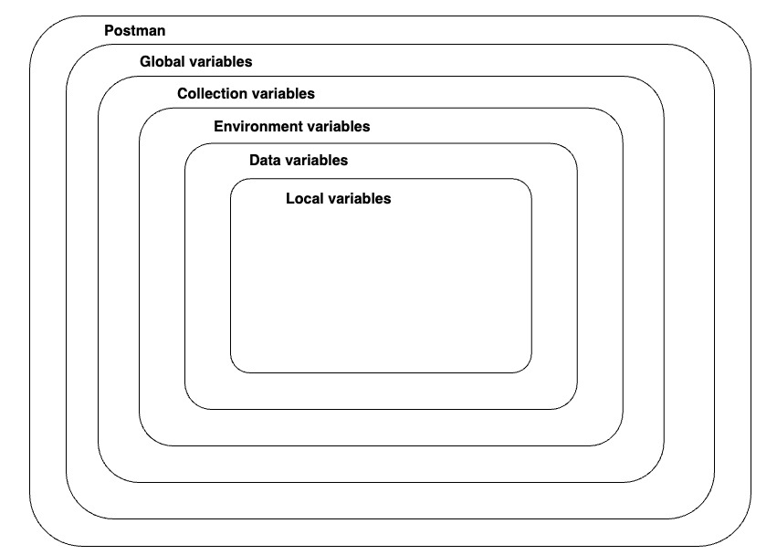

An **Application Programming Interface (API)** is a contract that allows code to talk to other code. APIs are the building blocks of modern software because they allow for sharing of resources and services across applications, organizations, and devices. APIs are not just for developers. API use is not limited to the tech and IT industries. Everyone benefits from APIs either directly or indirectly because APIs make processes more efficient and connect the services we love and rely on.<br><br>

Imagine, API to be the waiter in a restaurant who serves as the connection between the customers *(clients)* and cook in the kitchen *(server)*.
- Client is the requester. Ex: browser, web app, mobile app
- API is the implified interface for interacting with the backend
- Server is the backend where the processing happens<br><br>

Architecture types to build Api:
- REST (Representational State Transfer)
- GraphQL
- WebSockets
- Webhooks
- SOAP (Simple Object Access Protocol)
- gRPC (Google Remote Procedure Call)
- MQTT (MQ Telemetry Transport)<br><br>

Various types of API based on medium:
- Hardware APIs<br>
  Interface for software to talk to hardware.
  Example: How your phone's camera talks to the operating system. 
- Software Library APIs<br>
  Interface for directly consuming code from another code base.
  Example: Using methods from a library you import into your application.
- Web APIs<br>
  Interface for communicating across code bases over a network.
  Example: Fetching current stock prices from a finance API over the internet.<br><br>

Various types of API based on scope:
- Public APIs (aka Open APIs)<br>
  Consumed by anyone who discovers the API
- Private APIs<br>
  Consumed only within an organization and not made public
- Partner APIs<br>
  Consumed between one or more organizations that have an established relationship<br><br>

**Postman** is an API platform for building and using APIs. Postman simplifies each step of the API lifecycle and streamlines collaboration so you can create better APIs faster and consume them with ease. That's why Postman is trusted by over 25 million users worldwide!

**cURL** stands for client uniform resource locator<br><br>

In the API-first world:
- APIs are considered a #1 priority
- APIs are easily consumable
- APIs are easily discoverable<br><br>

***API USED IN THIS COURSE WILL BE Public, Rest, web API***<br><br>

**REST APIs**<br>
Some traits of REST APIs include not storing session state between requests, the ability to cache, and the ability to send and receive various data types.
Collections are places to organize your API requests in Postman.<br><br>

Anatomy of a Request:
- Method
- Endpoint/path
- Parameters
- Headers
- Body<br><br>

**METHOD**<br>
It mentions the operation that we want to perform when we make an HTTP call to a server, we specify a request method that indicates the type of operation we are about to perform. These are also called *HTTP verbs*.
REST API allows you to CRUD (Create, Read, Update, Delete)
Method to perform these operations:
- GET = Retrieve data (Read)
- POST = Send data (Create)
- PUT/PATCH* = Update data (Update)<br>
  PUT usually replaces an entire resource whereas PATCH usually is for partial updates<br>
- DELETE = Delete data (Delete)<br><br>

**ENDPOINT**<br>
The url on which the method is performed. In addition to a request method, a request must include a request URL that indicates where to make the API call. A request URL has three parts: *protocol*, *host* (location of the server), and *path* (route on the server).

| Protocol | Host                       | Path  |
|----------|----------------------------|-------|
| https://  | library-api.postmanlabs.com | books |

Paths and complete URLs are also sometimes called API endpoints.<br><br>

**PARAMETERS**
- Query parameter<br>
Some APIs allow you to refine your request further with key-value pairs called query parameters.
Query parameters are added to the end of the path. They start with a question mark (?) followed by the key-value pairs in the format: <key>=<value>. If there are multiple query parameters, each is separated by an ampersand (&). This can alos be done under the Params tab with setting the key & value and Postman syncs the changes made to the request URL

- Path Variable<br>
Another way of passing request data to an API is via path variables (path parameters). A path variable is a dynamic section of a path and is often used for IDs and entity names such as usernames. The path variable comes immediately after a slash in the path. There can be multiple path variables in a single request.<br>

Note: Some API documentation uses colon syntax to represent a wildcard in the path like /users/:username, while some use curly braces like /users/{username}. They both mean the same thing: that part of the path is dynamic!

 <br><br>

**BODY** <br>
You will need to send body data with requests whenever you need to add or update structured data. Typically, you will use body data with PUT, POST, and PATCH requests.
The Body tab in Postman enables you to specify the data you need to send with a request. You can send different types of body data to suit your API.
You can use raw body data to send anything you can enter as text. Use the raw tab, and the type dropdown list to indicate the format of your data (Text, JavaScript, JSON, HTML, or XML), and Postman will enable syntax-highlighting and appending the relevant headers to your request.<br><br>

**STATUS CODES** <br>
Status codes are indicators of whether a request failed or succeeded.<br>
2xx = Successful<br>
200 - OK<br>
201 - Created<br>
204 - No Content<br>

3xx = Redirection<br>
301 - Moved<br>
304 - Not modified<br>

4xx = Client error<br>
400 - Bad Request<br>
401 - Unauthorized<br>
403 - Forbidden<br>
404 - Not Found<br>

5xx = Server error<br>
500 - Internal Error<br>
501 - Not Implemented<br>
502 - Bad Gateway<br>
503 - Service Unavailable<br>
504 - Gateway Timeout<br><br>

**REQUEST - RESPONSE PATTERN** <br>
The client is the agent making a request [browser or an application]. The request is sent over a network to some server. The server will interpret the request and sent the appropriate response over the network back to the Postman client.<br>
 <br><br>

**VARIABLES** <br>
Postman allows to save values as variables, so that you can:  
- Reuse values to keep your work DRY (Don’t Repeat Yourself)
- Hide sensitive values like API keys from being shared publicly<br>

You can access it using double curly brace syntax like this: {{variableName}}<br>
Initial Value - the value initially set when someone forks or imports your collection. Note that if you share your collection with others, they will see this value, so don't put any secrets here!<br>
Current Value - Postman always resolves the variable to this value. This is local to your Postman account, and not public. It is good to keep secrets like API Keys ONLY in this column and not include them in the Initial Value column.<br>

From broadest to narrowest, the scopes of variables are *global*, *collection*, *environment*, *data*, and *local*.

 <br><br>

**AUTHORIZATION [auth]** <br>
There are multiple methods for authorizing a request. Some examples are:
- Basic Auth (username and password)
- OAuth (delegated authorization)
- API Keys (secret strings registered to a developer from an API portal). <br>

APIs that use API Key auth usually allow developers to sign up in a developer portal, where they will receive a random API Key that can be used to authorize their requests to the API. The API Key allows the API to track who is making calls and how often.  

The Postman Library API v2 uses very light protection and does not require you to register for an API Key.<br>
Header name[key]: api-key<br>
Header value: postmanrulz<br><br>

**SCRIPTING** <br>
Postman allows you to add automation and dynamic behaviors to your collections with scripting. 
Postman will automatically execute any provided scripts during two events in the request flow:
- Immediately before a request is sent: pre-request script (Pre-request Script tab of request).
```
console.log(pm.request)
```
- Immediately after a response comes back: test script (Tests tab of request).
```
console.log(pm.response.json())
```
<br><br>

**'pm' OBJECT** <br>
Postman has a helper object named pm that gives you access to data about your Postman environment, requests, responses, variables and testing utilities.
For example, you can access the JSON response body from an API with:
```
pm.response.json()
```
You can also programmatically get collection variables like the value of baseUrl with:
```
pm.collectionVariables.get(“baseUrl”)
```
In addition to getting variables, you can also set them with:
```
pm.collectionVariables.set("variableName", "variableValue")
pm.collectionVariables.set(“myVar”, “foo”)
```
<br>

Shortcut to create a fork:
` Ctrl + Alt + F `
<br><br>

**EXTERNAL LINKS**
- [Installation](https://learning.postman.com/docs/getting-started/installation/installation-and-updates/)
- [Desktop app](https://www.postman.com/downloads/)
- [Desktop Agent](https://www.postman.com/downloads/postman-agent/)
- [Blog](https://blog.postman.com/introducing-the-postman-agent-send-api-requests-from-your-browser-without-limits/)
- [Postman Documentation](https://learning.postman.com/docs/introduction/overview/)
- [Postman Library API v2 docs](https://documenter.getpostman.com/view/15567703/UVyxRtng)
